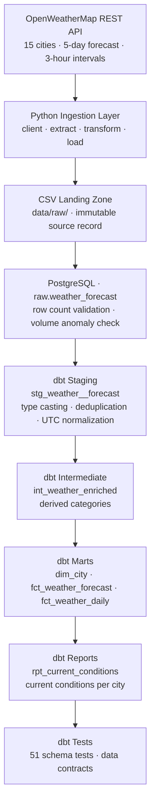

# Weather Data ELT Pipeline

ELT pipeline that pulls live weather forecast data from the OpenWeatherMap API across 15 cities, loads it into PostgreSQL, and transforms it into analytics-ready models using dbt — all orchestrated by Airflow running in Docker. Built to practice the kind of reliability and operational detail that matters in production: idempotent loads, data quality gates, schema drift handling, and CI via GitHub Actions.

---

## Key Engineering Features

- **REST API ingestion** — Pulls live 5-day forecast data for 15 cities with retry logic, timeout handling, and structured error logging
- **Idempotent loads** — Filename-keyed deduplication prevents duplicate ingestion across retries and backfills
- **Volume anomaly detection** — Each run's row count is compared against a 7-run rolling average; runs loading more than 50% fewer rows than the baseline fail before transformation begins
- **Schema contract enforcement** — A canonical column and dtype contract keeps the raw table's shape identical no matter which optional fields the API returned that day; unknown fields are dropped and logged rather than crashing the pipeline
- **Layered dbt architecture** — Staging, intermediate, mart, and report layers with clear separation of concerns and an incremental fact model driven by an `ingested_at` load watermark
- **51 dbt schema tests** — Uniqueness, not-null, range, accepted-value, and referential integrity checks enforced across the warehouse
- **Staging deduplication** — Overlapping forecast windows across DAG runs resolved in the staging model using `ROW_NUMBER()`
- **CI/CD via GitHub Actions** — Automated pytest suite runs on every push to master
- **58 pytest unit tests** — Validates transform logic, the raw schema contract, volume anomaly thresholds, atomic CSV writes, and file timestamp parsing
- **Structured logging** — Python `logging` module throughout the ingestion layer; Airflow task logs capture full run context including `dag_run_id`
- **Dockerized deployment** — Airflow and PostgreSQL run in isolated containers via Docker Compose

---

## Architecture



---

## Screenshots

**Airflow DAG**


**dbt Lineage Graph**


---

## Quality and Reliability

The pipeline runs three data quality checks before dbt ever touches the data: a row count validation, a volume anomaly check (current run compared against a 7-run rolling average), and dbt schema tests on the way out. If any of them fail, the run stops there.

Every row in the warehouse carries `source_file_name`, `ingested_at`, and `dag_run_id` — enough to trace any row back to the exact API call that produced it. Loads are idempotent, so backfilling a missed run or retrying a failed one is safe without cleanup. The 6 dbt models have 51 schema tests across uniqueness, not-null, range, and referential integrity checks. There are also 58 pytest unit tests covering transform logic, the raw schema contract, volume anomaly thresholds, atomic CSV writes, and timestamp parsing, run automatically on every push via GitHub Actions.

---

## Tech Stack

| Category | Tools |
|---|---|
| Orchestration | Apache Airflow |
| Transformation | dbt (dbt-postgres) |
| Warehouse | PostgreSQL |
| Compute | Docker · Docker Compose |
| Language | Python · SQL |
| Libraries | pandas · SQLAlchemy · psycopg2 · pytest |
| CI/CD | GitHub Actions |

---

## dbt Models

| Layer | Model | Description |
|---|---|---|
| Staging | `stg_weather__forecast` | Type casting, deduplication, UTC normalization |
| Intermediate | `int_weather_enriched` | Derived temp, wind, and precipitation categories |
| Mart | `dim_city` | City dimension, one row per city |
| Mart | `fct_weather_forecast` | Incremental 3-hour forecast fact table |
| Mart | `fct_weather_daily` | Daily aggregate (avg/min/max temp, precipitation totals) |
| Report | `rpt_current_conditions` | Current conditions view, one row per city |

---

## Repository Structure

```
weather_pipeline/
├── .github/
│   └── workflows/
│       └── ci.yml                     # GitHub Actions: pytest on push
├── dags/
│   └── weather_forecast_pipeline.py   # Airflow DAG definition
├── data/                              # contents gitignored; dirs ship empty
│   ├── raw/                           # CSV output files from each DAG run
│   └── processed/                     # unused, reserved
├── dbt/
│   ├── models/
│   │   ├── staging/weather/
│   │   │   ├── stg_weather__forecast.sql
│   │   │   ├── schema.yml
│   │   │   └── weather_sources.yml
│   │   ├── intermediate/
│   │   │   └── int_weather_enriched.sql   # Temp, wind, and precip categories
│   │   ├── marts/
│   │   │   ├── dim_city.sql               # City dimension
│   │   │   ├── fct_weather_forecast.sql   # Incremental 3-hour forecast fact
│   │   │   ├── fct_weather_daily.sql      # Daily aggregate fact
│   │   │   └── schema.yml
│   │   └── reports/
│   │       └── rpt_current_conditions.sql # Latest forecast per city
│   ├── macros/
│   │   └── generate_schema_name.sql       # Prevents dbt from prepending target schema
│   ├── profiles.yml                       # dev and prod targets
│   ├── dbt_project.yml
│   └── packages.yml
├── tests/
│   ├── conftest.py                    # Shared pytest fixtures
│   ├── test_transform.py              # Transform logic unit tests
│   ├── test_schema.py                 # Raw column/dtype contract tests
│   ├── test_quality_checks.py         # Volume anomaly threshold tests
│   ├── test_load.py                   # Atomic CSV write tests
│   └── test_postgres_loader.py        # postgres_loader unit tests
├── src/
│   ├── client.py                      # OpenWeatherMap API client
│   ├── extract.py                     # Calls API and returns raw records
│   ├── transform.py                   # Cleans and flattens records
│   ├── schema.py                      # Canonical raw column and dtype contract
│   ├── load.py                        # Writes records to CSV
│   ├── postgres_loader.py             # Loads CSVs into raw.weather_forecast
│   ├── quality_checks.py              # Volume anomaly detection
│   ├── main.py                        # CLI entrypoint (runs full pipeline locally)
│   ├── logging_config.py
│   └── utils.py
├── docs/
│   ├── airflow_dag.png                # Airflow DAG graph
│   └── dbt_lineage.png                # dbt lineage graph
├── config/
│   └── airflow.cfg
├── docker-compose.yml
├── Dockerfile
├── requirements.txt                   # Pipeline dependencies
├── requirements-airflow.txt           # Airflow dependencies
├── .env.example                       # Template for required environment variables
└── .env                               # Local environment variables (not committed)
```

---

## Database Schema

### raw.weather_forecast
Loaded directly from CSV files by Airflow. Includes all raw API fields plus pipeline metadata:

The 34 API columns are fixed by the contract in `src/schema.py`, so this shape does not change with the weather. Types below are what `to_sql` creates from the pinned pandas dtypes.

| Column | Type | Description |
|---|---|---|
| dt | bigint | Forecast Unix timestamp |
| dt_txt | text | Forecast timestamp as text |
| main_temp | double precision | Temperature (°F) |
| main_feels_like | double precision | Feels-like temperature |
| main_temp_min / max | double precision | Min/max temperature |
| main_temp_kf | double precision | Internal temperature adjustment from the API |
| main_dew_point | double precision | Dew point |
| main_humidity | bigint | Humidity % |
| main_pressure | bigint | Atmospheric pressure |
| main_sea_level / grnd_level | bigint | Pressure at sea and ground level |
| wind_speed | double precision | Wind speed |
| wind_deg | bigint | Wind direction (degrees) |
| wind_gust | double precision | Wind gust speed |
| rain_3h | double precision | Rain volume (last 3 hours), null when no rain |
| snow_3h | double precision | Snow volume (last 3 hours), null when no snow |
| clouds_all | bigint | Cloud coverage % |
| visibility | bigint | Visibility distance |
| pop | double precision | Probability of precipitation (0-1) |
| sys_pod | text | Part of day indicator (d / n) |
| weather_id | bigint | Weather condition ID |
| weather_main | text | High-level condition (Rain, Clouds, etc.) |
| weather_description | text | Detailed condition |
| weather_icon | text | Icon code |
| city_id | bigint | City identifier |
| city_name | text | City name |
| city_country | text | Country code |
| city_population | bigint | City population |
| city_timezone | bigint | UTC offset in seconds |
| city_sunrise / sunset | bigint | Sunrise/sunset Unix timestamps |
| city_coord_lat / lon | double precision | Coordinates |
| source_file_name | text | Source CSV filename |
| source_file_ts | timestamp | Timestamp parsed from filename |
| ingested_at | timestamp | UTC time of ingestion |
| dag_run_id | text | Airflow DAG run ID |

The last four are pipeline metadata added at load time, not API fields.

### staging.stg_weather__forecast
dbt staging model. Casts all columns to correct types, normalizes timestamps to UTC, trims strings, and deduplicates by keeping the most recent ingestion for each `city_id` + `dt_utc` combination.

### intermediate.int_weather_enriched
Adds derived categorical columns on top of the staging model: `temp_category` (freezing / cold / mild / warm / hot), `wind_category` (calm / light / moderate / strong / storm), and `precip_type` (none / rain / snow / rain_and_snow).

### analytics.dim_city
City dimension table. One row per city, deduplicated using `ROW_NUMBER()` ordered by most recent forecast.

### analytics.fct_weather_forecast
Incremental 3-hour forecast fact table. Each run reads staging from the newest `ingested_at` already present in the table, so prior batches are not rescanned, and the `unique_key` of `(city_id, local_dt)` upserts rather than appends. That combination means a forecast the API later revises replaces its earlier row instead of being discarded as a duplicate.

### analytics.fct_weather_daily
Daily aggregate fact. Rolls up the 3-hour forecasts to one row per `city_id` + calendar date: avg/min/max temp, avg humidity, avg wind speed, total rain and snow.

### reports.rpt_current_conditions
Reporting view. Returns the single most-recent forecast per city with all enriched columns from `int_weather_enriched`. Ready for BI tool consumption.

---

## Failure Handling

The pipeline is designed to fail loudly at the point of failure rather than pass bad data downstream.

**API or network failure** — the `extract` task raises an exception if the API call fails or returns an unexpected response. Airflow retries the task twice with a 5-minute delay before marking the DAG run as failed.

To simulate: set `OPENWEATHER_API_KEY=invalid` in `.env`, restart the containers, and trigger the DAG. The `extract` task will fail with a non-200 response error. Downstream tasks do not run.

**Schema validation failure** — the `transform` task validates the structure of the API response before processing. If required fields (`list`, `city`) are missing or malformed, the task fails immediately and downstream tasks do not run.

To simulate: temporarily add `del data[0]["city"]` in `transform.py` before `validate_response` is called. The `transform` task will raise a `ValueError` with a clear message identifying the missing field.

**Volume anomaly failure** — the `volume_anomaly_check` task compares the current run's row count against a 7-run rolling average. If the current run loads more than 50% fewer rows than the rolling average, the DAG fails before dbt runs. The error message includes the `dag_run_id` so the anomalous run can be identified and inspected in the warehouse. The check is skipped automatically if fewer than 3 prior runs exist.

To simulate: temporarily set `ANOMALY_THRESHOLD_RATIO = 1.1` in `src/quality_checks.py` and trigger the DAG. It will fail at `volume_anomaly_check` with a clear message including the run ID. Restore to `0.5` after verifying.

**Data quality failure** — the `dbt_build` task runs and tests each model in dependency order, enforcing uniqueness, not-null checks, and range validation as it goes. Because tests run interleaved with the models rather than after all of them, a failing test on the staging model stops the marts and reports from being built on data already known to be bad.

To simulate: run `UPDATE raw.weather_forecast SET weather_id = NULL WHERE city_id = 5128581;` in the warehouse, then trigger the DAG. The `dbt_build` task will fail on the `not_null` test for `weather_id` and the downstream models will be skipped. Restore with `UPDATE raw.weather_forecast SET weather_id = 500 WHERE weather_id IS NULL;`.

This was observed in practice when overlapping forecast data caused a uniqueness violation, which was resolved by deduplicating in the staging model using `ROW_NUMBER()`.

---

## Testing

The test suite runs outside Docker, so create a virtualenv first. `venv/` is gitignored, so a fresh clone will not have one:

```bash
python3 -m venv venv
source venv/bin/activate
pip install -r requirements.txt
python -m pytest tests/ -v
```

58 tests across five files:

- `test_transform.py` — validates `validate_response` (input shape, missing fields, wrong types) and `transform_records` (output schema, row count, city broadcast, bad date handling, weather field flattening)
- `test_schema.py` — validates the canonical column and dtype contract: optional fields absent from a payload are filled with nulls, unknown fields are dropped, column order is stable, and integer columns keep an integer rendering even when a null forces a float promotion
- `test_quality_checks.py` — validates the volume anomaly thresholds, including the boundary case, the insufficient-history skip, and an empty warehouse
- `test_load.py` — validates that CSV writes are atomic: no temp file is left behind on success, no partial CSV is left at the target path on failure, back-to-back writes do not collide, and the generated filename round-trips through the parser
- `test_postgres_loader.py` — validates `parse_source_file_ts` (both filename formats, full path, missing prefix, malformed timestamp) and the structured load result formatting

Shared fixtures live in `conftest.py`. The CI workflow in `.github/workflows/ci.yml` runs the full suite on every push and pull request to master.

---


## Known Limitations

**Schema drift from newly added API fields** — the `raw.weather_forecast` table schema is inferred from the first CSV loaded via pandas `to_sql`. When the OpenWeatherMap API returns a field not present in the original table (e.g., a newly added field like `main_dew_point`), the load task would previously fail with:

```
psycopg2.errors.UndefinedColumn: column "main_dew_point" of relation "weather_forecast" does not exist
```

**Current behavior** — `postgres_loader.py` now handles this gracefully. On each load, `align_columns_to_table` queries `information_schema` to compare the DataFrame columns against the actual table columns. Any unknown columns are dropped before the insert and a warning is logged:

```
WARNING - Dropping 1 unknown column(s) not present in raw.weather_forecast: ['main_dew_point'] — run ALTER TABLE to start capturing this data
```

The pipeline does not fail. The new field is ignored until a deliberate decision is made to capture it.

**To approve a new column** — once the warning is observed in the Airflow logs, run the appropriate `ALTER TABLE` in the warehouse:

```sql
ALTER TABLE raw.weather_forecast ADD COLUMN main_dew_point numeric;
```

The next DAG run will pick up the column automatically with no code changes required. At production scale this pattern would be replaced by a migration tool like Alembic that versions schema changes as auditable migration scripts.

**Conditionally-absent known fields** — a separate case from schema drift. The API omits optional keys entirely rather than sending nulls: `snow_3h` appears only when some city has snow forecast, `rain_3h` only when some city has rain. Because `to_sql` creates the raw table from the first file it sees, a snow-free first load used to produce a table with no `snow_3h` column, and the staging model selects it unconditionally. A clone started in summer therefore died on `column "snow_3h" does not exist`.

`src/schema.py` fixes this with a canonical contract. `conform_to_schema` reindexes every frame to a fixed 34-column list before it is written or loaded, filling absent columns with nulls and dropping unrecognized ones with a warning. It also pins dtypes, because pandas infers them per file: one null promotes an integer column to float, and `"10000.0"` is not valid input for a `BIGINT` column. The contract is applied in both `transform.py` and `postgres_loader.py`, so CSVs written before it existed still produce a complete table.

Adding a genuinely new API field is a deliberate one-line change to `FORECAST_COLUMNS` plus an `ALTER TABLE`, rather than something that happens silently based on the weather.

**dbt-core and apache-airflow-providers-postgres must stay pinned in requirements-airflow.txt** — `dbt/models/marts/schema.yml` uses the `arguments:` generic-test syntax (dbt-core >=1.9), so `requirements-airflow.txt` pins `dbt-core==1.11.8`/`dbt-postgres==1.10.0` to match `requirements.txt` (the local, no-Docker venv path) exactly. Left unpinned, a fresh build can resolve an incompatible dbt-core (too old for the test syntax, or a pre-release) purely based on whatever's newest on PyPI that day — this has broken from-scratch builds before without anyone noticing, since Docker layer caching usually reused an old, working resolution. `apache-airflow-providers-postgres` is pinned to `5.10.0` in its own separate `RUN` step in the `Dockerfile` for the same reason (left unpinned, it resolves a release built for Airflow 3.x) and to avoid pip backtracking for a very long time when resolved together with the dbt pins. See the comments in `Dockerfile` and `requirements-airflow.txt` before changing any of these.

---

## Incident Log

> Entries below describe the pipeline as it was at the time. The separate
> `dbt_run` and `dbt_test` tasks referenced here were later consolidated into a
> single `dbt_build` task.

### June 2026 — cascading failure from schema change and backfill

**What happened:**
3 consecutive DAG runs failed at `load_raw_table` because the OpenWeatherMap API began returning a new field (`main_dew_point`) that did not exist in `raw.weather_forecast`. The extract and transform tasks succeeded each time and CSVs were written to `data/raw/`, but the Postgres load failed before any rows were inserted.

**Fix 1 — schema:**
`ALTER TABLE raw.weather_forecast ADD COLUMN main_dew_point numeric` was run in the warehouse. `align_columns_to_table` was added to `postgres_loader.py` to handle future unknown columns gracefully rather than failing.

**Fix 2 — backfill:**
`make backfill` was run to load the 3 missed CSVs. Because `skip_if_loaded` uses the filename as the key, only the unloaded files were inserted — no duplicates.

**Second issue — null city metadata:**
The backfill also picked up older CSVs from before city columns were added to the extract logic. Those files loaded successfully but contributed 320 rows with null `city_id`, `city_name`, and related city columns.

**Caught by dbt tests:**
The `dbt_test` task failed on not-null constraints for `city_id`, preventing the mart from being updated with bad data. This was the intended behavior — the pipeline failed loudly rather than propagating nulls downstream.

**Fix 3 — data patch:**
The 320 rows were patched directly in `raw.weather_forecast` using a CTE UPDATE that sourced city values from valid rows with matching structure. The original CSVs were left untouched as the permanent record of what the API returned at that time. After patching, `dbt_run` and `dbt_test` both passed and the incremental model picked up all backfilled rows automatically.

---

## Setup

### Prerequisites
- Docker and Docker Compose
- OpenWeatherMap API key — sign up free at [openweathermap.org/api](https://openweathermap.org/api) (the free tier covers this pipeline's 5-day/3-hour forecast calls). New keys can take up to a couple hours to activate.

### Environment Variables

Copy `.env.example` to `.env` and fill in real values:

```bash
cp .env.example .env
```

```
OPENWEATHER_API_KEY=<your key from openweathermap.org>
WAREHOUSE_USER=weather_user
WAREHOUSE_PASSWORD=weather_pass
WAREHOUSE_DB=weather_db
WAREHOUSE_HOST=postgres-warehouse
WAREHOUSE_PORT=5432
```

Only `OPENWEATHER_API_KEY` needs to be changed — all other values match the Docker Compose defaults and can be left as-is.

Also set `AIRFLOW_UID` to your host user's UID, so files the containers create (logs, dbt artifacts, raw CSVs) end up owned by you instead of a fixed container UID — this is Airflow's own documented setup step, not specific to this repo:

```bash
echo "AIRFLOW_UID=$(id -u)" >> .env
```

If you skip this, everything still runs — `airflow-init` falls back to UID `50000` — but `data/`, `logs/`, and dbt's `target/`/`dbt_packages/` directories will end up owned by that UID on your host, and you'll need `sudo chown` to edit files under them afterward. `dags/`, `src/`, and the rest of `dbt/` are left alone either way.

### Start Airflow

```bash
docker compose up
```

Airflow UI available at `http://localhost:8080` (admin / admin).
The warehouse Postgres is available at `localhost:5432`.

If either port is already in use, set `AIRFLOW_WEBSERVER_PORT` / `WAREHOUSE_HOST_PORT` in `.env` to remap the host side only — internal service-to-service traffic is unaffected.

Airflow pauses every DAG on creation by default (`AIRFLOW__CORE__DAGS_ARE_PAUSED_AT_CREATION`), so nothing — including a fresh deploy of this pipeline — runs unattended before a human enables it. `weather_forecast_pipeline` will sit `queued` if triggered until you unpause it:

```bash
docker compose exec airflow-scheduler airflow dags unpause weather_forecast_pipeline
```

(Same command for any new DAG you add — swap in its `dag_id`.)

### Create the Airflow Connection

After the containers are healthy, register the warehouse connection so Airflow can resolve credentials at runtime. This is a one-time step — the connection persists until the containers are torn down with `docker compose down -v`.

```bash
docker compose exec airflow-scheduler airflow connections add weather_warehouse \
    --conn-type postgres \
    --conn-host postgres-warehouse \
    --conn-login weather_user \
    --conn-password weather_pass \
    --conn-schema weather_db \
    --conn-port 5432
```

On Windows PowerShell, use a backtick instead of `\` for line continuation:

```powershell
docker compose exec airflow-scheduler airflow connections add weather_warehouse `
    --conn-type postgres `
    --conn-host postgres-warehouse `
    --conn-login weather_user `
    --conn-password weather_pass `
    --conn-schema weather_db `
    --conn-port 5432
```

If the connection is not found at runtime, `postgres_loader.py` falls back to the `.env` variables automatically.

---

## Running the Pipeline

### Via Airflow (recommended)

Trigger the DAG from the UI or CLI:

```bash
docker compose exec airflow-scheduler airflow dags trigger weather_forecast_pipeline
```

### Via CLI (local, no Docker)

```bash
source venv/bin/activate
python -m src.main
```

`main()` doesn't just load the CSV it just extracted — it calls `load_all_files()`, which loads *every* unloaded file already sitting in `data/raw/`, tagged under one `dag_run_id`. If that directory has accumulated many historical files (e.g. from months of local dev), one run of this command bulk-loads all of them at once. Harmless against a scratch database, but be aware if `WAREHOUSE_HOST`/`WAREHOUSE_PORT` happen to point at the same warehouse an Airflow deployment is also using — a single oversized `dag_run_id` group like that will skew `volume_anomaly_check`'s rolling average for every run afterward until it ages out of the last-7-runs window (or is deleted).

### Backfill existing CSV files

```bash
make backfill
```

Equivalent to `docker compose exec airflow-scheduler python -m src.postgres_loader all`, which walks every `output_*.csv` in `data/raw/` and loads the ones not already ingested. `skip_if_loaded` keys on the filename, so re-running is safe and will not duplicate rows.

### Makefile shortcuts

The most common commands are wrapped in a `Makefile`:

| Target | What it does |
|---|---|
| `make up` / `make down` | Start or stop the stack |
| `make restart` | Recreate the stack |
| `make logs` | Tail the scheduler logs |
| `make trigger` | Trigger the DAG |
| `make backfill` | Load every unloaded CSV in `data/raw/` |
| `make dbt-run` / `make dbt-test` / `make dbt-fresh` | Run dbt phases individually in the container |
| `make psql` | Open a psql shell on the warehouse |

---

## dbt

dbt runs automatically as part of the Airflow DAG. To run manually from the host:

```bash
source venv/bin/activate
set -a; source .env; set +a        # from the repo root
cd dbt
dbt deps
WAREHOUSE_HOST=localhost dbt build
```

`WAREHOUSE_HOST` has to be overridden. `.env` sets it to `postgres-warehouse`, which is the Compose service name and only resolves inside the Docker network. From the host the warehouse is reachable on the published port at `localhost:5432`.

### Which profiles.yml dbt uses

dbt picks exactly one `profiles.yml`; it never merges several. The search order is:

1. the `--profiles-dir` flag
2. the `DBT_PROFILES_DIR` environment variable
3. the current working directory
4. `~/.dbt/`

The DAG and the `Makefile` always pass `--profiles-dir /opt/airflow/dbt`, so inside the container this project's `dbt/profiles.yml` is used and nothing else is consulted.

Running manually is where it gets subtle. Because `cd dbt` puts this project's `profiles.yml` in the working directory, rule 3 wins and any `~/.dbt/profiles.yml` you may have is ignored. That is why the env vars above are required. If you would rather use a personal profile with the connection hardcoded, point at it explicitly:

```bash
dbt build --profiles-dir ~/.dbt
```

`dbt build` runs and tests each model in dependency order. `dbt run` and `dbt test` still work if you want the two phases separately, but `build` is what the DAG uses, because it stops a failing test from letting downstream models be built on bad data.

`dbt deps` installs the packages listed in `packages.yml` into `dbt_packages/` (gitignored) — required once before the first `dbt run`/`dbt test`/`dbt source freshness`, and again after `packages.yml` changes.

### Target switching (dev / prod)

The `DBT_TARGET` environment variable controls which `profiles.yml` target is used. It defaults to `dev`. Set `DBT_TARGET=prod` in the Airflow environment (or CI) to run against the production warehouse.

### Lineage


`raw.weather_forecast` → `stg_weather__forecast` → `int_weather_enriched` → `fct_weather_forecast` / `fct_weather_daily` / `rpt_current_conditions`

To regenerate docs:

```bash
docker compose exec airflow-scheduler bash -c "cd /opt/airflow/dbt && dbt docs generate --profiles-dir /opt/airflow/dbt"
```

---

## Sample Output (raw CSV)

Files land in `data/raw/` named `output_YYYYMMDD_HHMMSS_ffffff.csv`, for example `output_20260916_213806_623756.csv`. The microsecond component keeps two runs starting in the same second from resolving to the same path. Each file is written to a temp file and then atomically renamed into place, so a partially written CSV is never visible to the loader.

Columns are always the same 34 in the same order, per the contract in `src/schema.py`, regardless of which optional fields the API returned:

```
dt,visibility,pop,dt_txt,main_temp,main_feels_like,main_temp_min,main_temp_max,main_pressure,main_sea_level,main_grnd_level,main_humidity,main_temp_kf,main_dew_point,clouds_all,wind_speed,wind_deg,wind_gust,sys_pod,rain_3h,snow_3h,city_id,...
1789603200,10000,0.0,2026-09-17 00:00:00,75.83,76.44,74.12,75.83,1025,1025,1021,71,0.95,65.77,65,3.98,145,7.87,n,,,5128581,...
```

The two empty fields before `city_id` are `rain_3h` and `snow_3h`, absent from the API payload on a dry day and filled with nulls rather than dropped.
